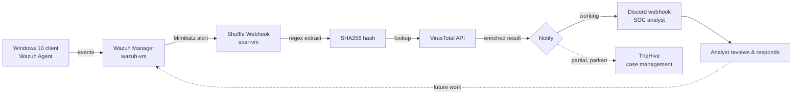
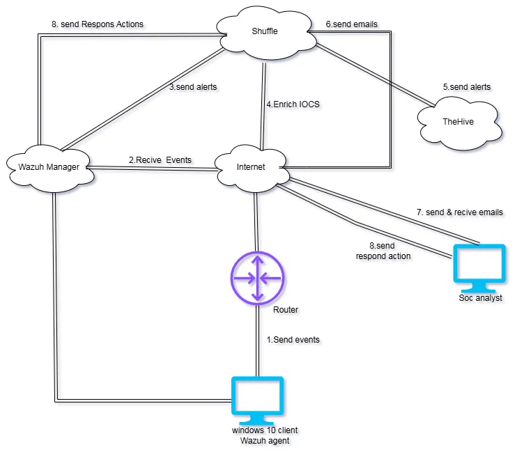

# 🛡️ SOC Automation Home Lab — Wazuh + Shuffle SOAR


A home-built Security Operations Center (SOC) lab that catches a
**real** Mimikatz credential-dumping attack on a Windows 10 endpoint,
automatically checks the resulting file hash against VirusTotal, and
pings an analyst — no manual triage step, no synthetic test payloads,
start to finish.

New to SOC/SOAR terminology? Every unfamiliar term below is explained
in plain English in the **[Glossary](docs/GLOSSARY.md)**. This README
is written to be read start to finish by someone who's never touched
Wazuh or Shuffle before.

## Contents

- [What this actually does](#what-this-actually-does)
- [Architecture](#architecture)
- [Live Result](#live-result)
- [Environment](#environment)
- [The Workflow](#the-workflow-wazuh-mimikatz-alerts)
- [Known Issues / Follow-up Work](#known-issues--follow-up-work)
- [What building this actually taught me](#what-building-this-actually-taught-me)
- [Repo Structure](#repo-structure)
- [Docs](#docs)

## What this actually does

In plain terms: a Windows machine gets attacked with a real
credential-dumping tool (Mimikatz), a security agent on that machine
notices and reports it, and — without a human clicking anything — the
lab automatically looks up whether the file involved is known-bad and
drops a clean, readable alert card into Discord for a human to review.

That's the entire "detect → enrich → notify" loop that a much bigger
SOC's automation would do, built from scratch, on two small cloud VMs,
for free-tier-ish money.

<details>
<summary><b>▶ Click here if you want the one-paragraph "why build this at all"</b></summary>

Reading about SOAR tools and actually wiring one up to a real detection
pipeline surface completely different problems — mismatched app-field
syntax, cloud firewall layers stacked three deep, a "test single node"
button that quietly lies to you about whether your variables resolve.
This repo exists to keep an honest record of all of that, not just the
finished, working diagram. See
[What building this actually taught me](#what-building-this-actually-taught-me)
and the full [troubleshooting log](docs/troubleshooting.md) for the
unfiltered version.

</details>

## Architecture





| # | Step | Component | Status |
|---|------|-----------|--------|
| 1 | Windows 10 client (Wazuh agent) sends events | Wazuh Agent → Wazuh Manager | ✅ working |
| 2 | Wazuh Manager receives events | Wazuh Manager | ✅ working |
| 3 | Wazuh Manager sends alerts | Wazuh Manager → Shuffle | ✅ working |
| 4 | Shuffle enriches the IOC (hash) | Shuffle → VirusTotal | ✅ working |
| 5 | Alert sent onward | Shuffle → TheHive | 🟡 partial — see [troubleshooting](docs/troubleshooting.md#thehive-node) |
| 6 | Notification sent | Shuffle → Discord (SOC analyst) | ✅ working |
| 7 | Analyst reviews / responds | SOC analyst | ✅ manual, by design |
| 8 | Response actions sent back | Shuffle → Wazuh Manager | ⏳ future work |

## Live Result

<table>
<tr>
<td width="50%">

**Real detection in Wazuh:**


</td>
<td width="50%">

**Structured alert delivered to the analyst:**


</td>
</tr>
</table>

<details>
<summary><b>▶ See the raw pipeline run, node by node</b></summary>

<br>

| Node | What it did | Evidence |
|---|---|---|
| Regex capture | Pulled the SHA256 out of Wazuh's combined hash string |  |
| VirusTotal | Looked up the hash's reputation, got a real `200` back |  |
| HTTP → Discord | Posted the structured embed, got a real `204` back |  |

Every one of these ran as part of the same single end-to-end workflow
execution — not stitched together from separate test runs. Why that
distinction matters is its own troubleshooting story:
[Test Action vs. full workflow run](docs/troubleshooting.md#test-action-vs-full-run).

</details>

## Environment

Two Oracle Cloud ARM VMs (1 OCPU / 6GB each), Docker Compose throughout:

- **wazuh-vm** — Wazuh Manager (single-node: manager + indexer + dashboard)
- **soar-vm** — TheHive stack (Cassandra, Elasticsearch, MinIO, TheHive 5.6)
  and Shuffle stack (frontend, backend, orborus, opensearch)

Getting these two boxes to actually talk to each other over the
network — and specifically, discovering that Oracle Cloud has **two**
separate firewalls stacked in front of the OS-level one — turned out
to be the single biggest time sink in the whole build.

📄 Full setup notes, including that networking story:
**[docs/setup.md](docs/setup.md)**

## The Workflow: "Wazuh-Mimikatz-Alerts"

1. **Trigger** — Wazuh sends a Mimikatz-detection alert to a Shuffle webhook.
2. **Extract** — A regex node pulls the clean SHA256 hash out of Wazuh's
   combined `hashes` field (`MD5=...,SHA256=...,IMPHASH=...`).
3. **Enrich** — The SHA256 is looked up against the VirusTotal v3 API.
4. **Notify** — A structured alert (agent name, rule, severity, hash) is
   posted to a Discord channel via webhook, standing in for a SOC
   analyst's inbox.


📄 Full build walkthrough, with the reasoning behind each node, not
just the final config: **[docs/workflow.md](docs/workflow.md)**

## Known Issues / Follow-up Work

<details>
<summary><b>🟡 TheHive alert-creation step is not yet wired in</b></summary>

The built-in Shuffle TheHive app has a field-name bug (`source`
parameter breaks the underlying API call). Root cause and a working
alternative (raw HTTP POST, the same trick that already fixed Discord)
are documented in
[docs/troubleshooting.md](docs/troubleshooting.md#thehive-node).

</details>

<details>
<summary><b>🟠 Email notification (Shuffle's hosted "Send email" action) 404s</b></summary>

Fails on this self-hosted instance — it appears to route through
Shuffle's hosted cloud service rather than sending mail directly.
Replaced with a Discord webhook instead. See
[docs/troubleshooting.md](docs/troubleshooting.md#email-notification).

</details>

<details>
<summary><b>⏳ Step 8 (automated response actions back to Wazuh) not yet built</b></summary>

Architected in the diagram above but not yet implemented — planned
next step once the alerting pipeline is fully hardened. The idea:
close the loop so Shuffle can trigger a real containment action (e.g.
isolate the agent) automatically for high-confidence detections.

</details>

## What building this actually taught me

The finished pipeline is the least interesting part of this repo. The
genuinely useful takeaways:

- **Cloud firewalls stack.** "It's not reachable" almost never means
  one thing is broken — on OCI specifically, check the Security List
  and NSG before ever touching `ufw`.
- **A UI field that "looks" wrong isn't always wrong.** Shuffle's
  `group_0.#` list-index placeholder looked like a broken template
  right up until a real end-to-end run proved it wasn't. Test the
  actual pipeline, not your intuition about the syntax.
- **"Test this one node" and "run the workflow" are different
  questions**, and conflating them produced most of the confusing
  errors in this build. If you ever see a literal `$` in an error
  message, suspect this first.
- **When a built-in integration fights you, a generic HTTP node is
  usually a faster, more honest fix** than chasing the integration's
  bug — this is how both the Discord step and the (queued) TheHive fix
  got unblocked.
- **Automation gets its own login.** Giving Shuffle a dedicated
  service account (`shuffle@test.com`) into TheHive, separate from the
  human analyst account, kept the blast radius of any future incident
  smaller and the audit trail cleaner.
- **Write down admin credentials somewhere durable.** Losing TheHive's
  admin login cost an entire stack reinstall — a genuinely expensive
  way to relearn a one-line habit.

Every one of these has the full incident writeup, with root cause and
fix, in **[docs/troubleshooting.md](docs/troubleshooting.md)** — it's
written to be read as a log, issue by issue, in the order they
actually happened.

## Repo Structure

```
.
├── README.md
└── docs/
    ├── setup.md            # VM + service setup, with the "why", not just the "how"
    ├── workflow.md          # Step-by-step Shuffle workflow build, taught not just shown
    ├── troubleshooting.md   # Every issue hit, root cause, and fix — collapsible, color-coded
    ├── GLOSSARY.md          # Plain-English definitions for every SOC/SOAR term used here
    └── screenshots/         # All referenced images
```

## Docs

| Doc | What's in it |
|---|---|
| [docs/setup.md](docs/setup.md) | VM sizing, Docker Compose stacks, the networking gotcha, explained |
| [docs/workflow.md](docs/workflow.md) | Full step-by-step build of the Shuffle workflow, taught node by node |
| [docs/troubleshooting.md](docs/troubleshooting.md) | Every issue hit, root cause, and fix — collapsible, color-coded by severity |
| [docs/GLOSSARY.md](docs/GLOSSARY.md) | New to SOC/SOAR? Start here for the vocabulary |

---

Questions, spotted something off, or just want to say the Discord
embed is genuinely nice? Open an issue — this lab is still growing.
