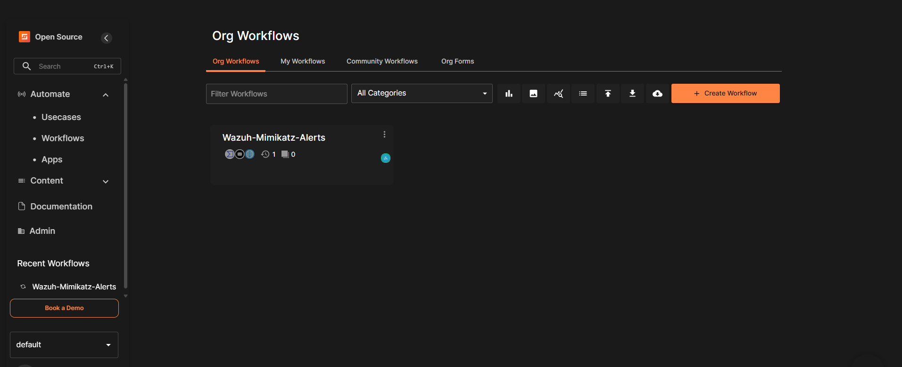

# 🧱 Environment Setup

This page walks through *how* the lab's infrastructure was put
together, and — more usefully — *why* it's shaped the way it is. If a
term feels unfamiliar, the [glossary](GLOSSARY.md) probably has it.

## The big picture

Everything runs on **two** small cloud VMs rather than one big one.
That split wasn't accidental — Wazuh's indexer and TheHive's
Cassandra + Elasticsearch stack are both memory-hungry, and cramming
everything onto a single 6GB box meant they'd constantly fight each
other for RAM. Two VMs, each doing one job well, was simpler to
reason about and easier to firewall.

## Infrastructure

Two Oracle Cloud **ARM** VMs (cheaper and, on the free/low tiers,
more generously resourced than x86), 1 OCPU / 6GB RAM each, each with
a swap file added as headroom for the inevitable memory spikes.

| VM | Purpose |
|----|---------|
| `wazuh-vm` | Wazuh Manager — the detection engine (manager + indexer + dashboard, all in one Docker stack) |
| `soar-vm` | The response side — TheHive (case management) + Shuffle (the SOAR/automation engine) |

## `wazuh-vm` — the detection engine

Wazuh is what actually watches the endpoint and decides "this looks
like Mimikatz." It was deployed as a single-node Docker stack
(manager + indexer + dashboard together), sized to fit the 1 OCPU/6GB
box with swap as a safety net.

1. Brought the stack up via Docker.
2. Confirmed the dashboard was reachable over HTTPS.
3. Changed every default password immediately — Wazuh ships with
   well-known defaults, and this VM is internet-facing.
4. Enrolled a Windows 10 VM as a Wazuh agent (`win-agent1`) — this is
   the machine Mimikatz actually gets run on to generate a real alert.

*The Wazuh dashboard, live and reachable — the starting point for
everything downstream.*

## `soar-vm` — TheHive stack (case management)

Deployed via `docker compose` in `~/soar-lab/thehive`:

- **Cassandra 4.1** — the database
- **Elasticsearch 7.17.23** — search/indexing for cases and alerts
- **MinIO** — S3-compatible object storage, used for case attachments
- **TheHive 5.6** (StrangeBee edition) — the case-management UI itself

Memory-tuned to roughly 2.5GB total, leaving headroom for the Shuffle
stack sharing the same box.

**Setup steps:**
1. `docker compose up -d`.
2. Created an organisation for the lab (currently `myAuTo_lab` — this
   org was recreated once, after a credential-loss incident; see
   [troubleshooting.md](troubleshooting.md#lost-thehive-credentials--full-reinstall)
   for that story).
3. Created a normal analyst login (`ayush@test.com`) — the human who
   reviews cases.
4. Created a **separate service account** (`shuffle@test.com`, also on
   the `analyst` profile) purely for Shuffle to authenticate with. See
   why this matters in the [glossary](GLOSSARY.md#service-account) —
   short version: automation gets its own login so it can be
   monitored and revoked independently of any human's.
5. Created a throwaway test case to confirm Cassandra + Elasticsearch
   were both actually working end-to-end, not just "container is
   running."
6. Confirmed MinIO by uploading a test attachment successfully.

*Organisation list: `admin` (system default) and `myAuTo_lab` (the
lab's working org).*

*Two users inside `myAuTo_lab`: `ayush` (Normal, human analyst) and
`SOAR` (Service, the account Shuffle authenticates as).*

> 🩹 **Community edition nags for a license.** You'll see a red
> "license is invalid / trial expires in N days" banner throughout
> these screenshots — that's cosmetic, from TheHive's free Community
> tier. Alert/case creation via the API is unaffected. See
> [troubleshooting.md](troubleshooting.md#also-thehive-license-banner).

## `soar-vm` — Shuffle stack (the automation engine)

Deployed via `docker compose` in `~/soar-lab/Shuffle`:

| Container | Memory cap | Job |
|---|---|---|
| `frontend` | 150m | The UI you build workflows in |
| `backend` | 500m | API + workflow execution engine |
| `orborus` | 150m | Orchestrates the worker containers that actually run each app node |
| `opensearch` | 1200m (512m JVM heap) | Shuffle's own internal search/logging store |

**Setup steps:**
1. `docker compose up -d`.
2. Logged into the Shuffle UI as admin at `http://<soar-vm-ip>:3001`.

*Shuffle's UI, reachable and showing the `Wazuh-Mimikatz-Alerts`
workflow — this is the canvas everything in
[workflow.md](workflow.md) happens on.*

## Networking — the two-firewall trap

**This is worth reading even if you skip everything else on this
page**, because it's the single most time-consuming issue hit while
building the lab (full story in
[troubleshooting.md](troubleshooting.md#networking)).

On Oracle Cloud, opening a port isn't a one-step operation. Traffic
has to clear **two separate cloud-level firewalls before it even
reaches the VM's own OS-level firewall (`ufw`)**:

1. The subnet's **OCI Default Security List**.
2. The **NSG** (Network Security Group) attached to the specific
   instance — `nsg-soar` for `soar-vm` in this lab.

`ufw` being configured correctly means nothing if either cloud-layer
firewall above it is still blocking the port — the traffic never even
arrives for `ufw` to evaluate. Every port below needed rules added in
**both** places:

| Port | Service |
|---|---|
| `9000` | TheHive UI |
| `9091` | MinIO console |
| `3001` | Shuffle UI |

> 💡 **Debugging tip learned the hard way:** if a brand-new service is
> unreachable on OCI, check the Security List and NSG **before**
> spending time on `ufw` or the application itself. It's rarely the
> last two.

## Full service inventory

For reference, once both stacks are up, `docker ps` on `soar-vm`
shows: `thehive`, `cassandra`, `elasticsearch`, `minio`,
`shuffle-frontend`, `shuffle-backend`, `shuffle-orborus`,
`shuffle-opensearch`, plus a set of Shuffle "app" worker containers
that get spun up automatically the first time a workflow uses them:
`virustotal_v3`, `email`, `http`, `shuffle-tools`, `shuffle-ai`,
`shuffle-subflow`, `shufflehealthcheck`.

---

⬅️ Back to [README](../README.md) · Next up: [workflow.md](workflow.md) →
