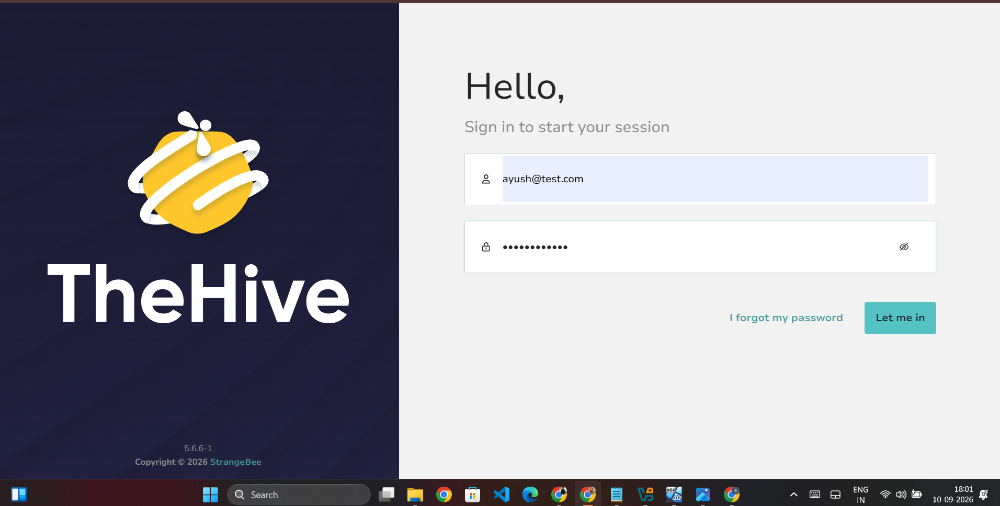
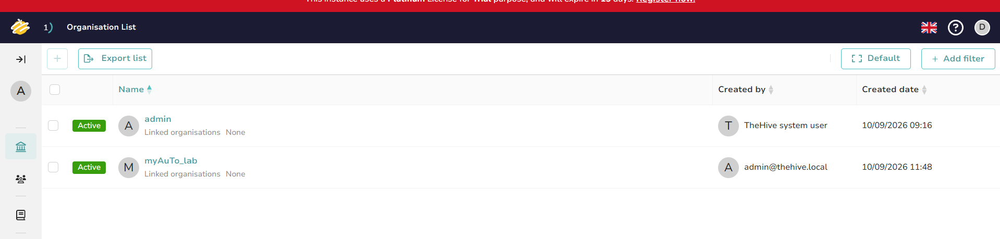
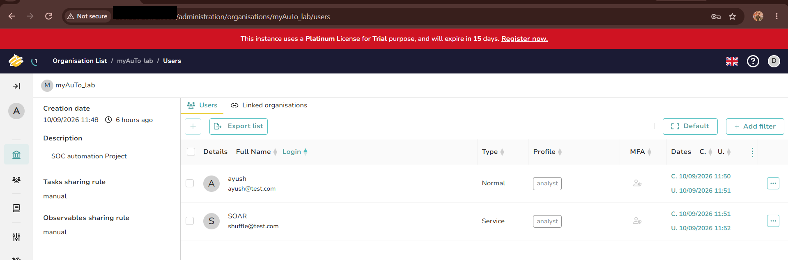

# 🧰 Troubleshooting Log

Every real issue hit while building this lab, in the order encountered,
with root cause and fix — kept honest, including the one that's still
unresolved. This page is arguably more useful than the finished
workflow itself: the finished thing hides how it actually got built.
Click any issue to expand it. Screenshot filenames match those
referenced in [workflow.md](workflow.md) and [setup.md](setup.md)
where applicable.

## Index

- [Networking (OCI Security List vs ufw)](#networking)
- [Shuffle permission issue on OpenSearch](#shuffle-permission-issue-on-opensearch)
- [Node-naming confusion (regex node vs. trigger)](#node-naming-confusion)
- [`Test Action` vs. full workflow run](#test-action-vs-full-run)
- [VirusTotal `Id` field — list index syntax](#virustotal-id-field--list-index-syntax)
- [TheHive node — field-mapping bug](#thehive-node)
- [Email notification 404](#email-notification)
- [Discord Content-Type header format](#discord-http-node--content-type-header-format)

---

<a name="networking"></a>
<details open>
<summary><b>🔴 Networking — OCI Security List vs. ufw</b></summary>

**Symptom:** Newly deployed services (Wazuh dashboard, TheHive UI, MinIO
console, Shuffle UI) weren't reachable from outside the VM, despite
`ufw` appearing correctly configured.

**Root cause:** The block was at the cloud network layer, not the OS
firewall — the **OCI Default Security List** for the subnet was missing
ingress rules. `ufw` looked fine because it never got hit; the traffic
was dropped before it reached the VM.

**Fix:** Add ingress rules to the OCI Default Security List **and** the
attached NSG (`nsg-soar` for soar-vm) for each port:
- `9000` (TheHive UI)
- `9091` (MinIO console — a typo'd port number in the NSG rule was the
  initial culprit here specifically; double-check the exact port number
  before assuming a deeper issue)
- `3001` (Shuffle UI)

**Lesson:** On OCI, always check the Security List/NSG layer first for
new-service unreachability, before troubleshooting `ufw` or the
application itself. See [glossary](GLOSSARY.md#oci-security-list-vs-nsg-vs-ufw)
for a plain-English breakdown of the three layers involved.

</details>

---

<a name="shuffle-permission-issue-on-opensearch"></a>
<details>
<summary><b>🟠 Shuffle permission issue on OpenSearch</b></summary>

**Symptom:** OpenSearch (Shuffle's dependency) threw
`AccessDeniedException` on its bind-mounted data directory
(`./shuffle-database`).

**Root cause:** The container's internal user lacked write permissions
on the host-mounted directory.

**Fix:** `chown`/`chmod` the host directory to match what the container
expects, then restart. Cluster health went `GREEN` immediately after.

</details>

---

<a name="node-naming-confusion"></a>
<details>
<summary><b>🟡 Node-naming confusion (regex node vs. trigger)</b></summary>

**Symptom:** Extensive back-and-forth trying to add a "new" Regex node,
believing the trigger node itself needed to stay untouched.

**Root cause:** The Regex capture group node in this workflow kept its
Shuffle-assigned default name, `Receive_Wazuh_alerts` — identical in
appearance to a plausible trigger name. This made it look, from the
config panel alone, like the *trigger* had been reconfigured into a
regex node (which would have broken it), when in fact it was a
perfectly normal **separate, connected node** that simply hadn't been
renamed from its default.

**Fix:** No action needed once the canvas was viewed zoomed-out — three
distinct connected nodes (`Webhook` → `Receive_Wazuh_alerts` [regex] →
`Virustotal v3 1`) were visible the whole time.

**Lesson:** Rename nodes away from their Shuffle-assigned defaults
("Change Me", or auto-copied names) immediately after adding them, to
avoid this exact confusion later. Five extra seconds at creation time,
versus twenty minutes of "wait, is this actually the trigger?" later.


</details>

---

<a name="test-action-vs-full-run"></a>
<details>
<summary><b>🔴 `Test Action` vs. full workflow run</b></summary>

**Symptom:** Downstream nodes (VirusTotal, TheHive, HTTP/Discord) failed
with parsing errors like `Unrecognized token '$'` or literal
`$variable.path` text appearing in output — even though the same
variable references worked fine elsewhere.

**Root cause:** Clicking **Test Action** on a single node in isolation
does *not* run its upstream dependencies. Any node not "under the
startnode" for that isolated test is marked `SKIPPED`, so
`$exec.*` and `$receive_wazuh_alerts.*` references have no real data to
resolve against — Shuffle passes the literal, unresolved text straight
through, which breaks JSON parsing on the receiving end (VirusTotal,
Discord, TheHive all rejected it with 400s for this reason at various
points).

**Fix:** Run the **entire workflow** via the canvas ▶️ Play button, then
inspect the specific node's result from that full run — not via that
node's own isolated "Test Action" button. The screenshots below show
what a *correct*, fully-resolved node result looks like after a real
end-to-end run (worth comparing against if you ever see a stray `$`
in your own output).


**Lesson:** Any 400 error containing a literal `$` in the error message
or in the request body/URL is almost always this issue, not a genuinely
wrong variable path. Check *how the node was triggered* before
re-writing the variable reference.

</details>

---

<a name="virustotal-id-field--list-index-syntax"></a>
<details>
<summary><b>🟢 VirusTotal `Id` field — list index syntax</b></summary>

**Symptom:** Early attempts to reference the regex output
(`group_0`, a list) directly caused VirusTotal to receive the whole
list (with brackets and quotes) instead of the plain hash string,
resulting in `404 NotFoundError`.

**Root cause:** `group_0` is a list type (even with one item). Selecting
it through the variable picker auto-inserts a `#` placeholder
(`group_0.#`) to represent "list index goes here." This is Shuffle's
own templating syntax and **resolves correctly at runtime** — it looked
broken during manual inspection but was not the actual bug once tested
via a full workflow run.

**Fix:** No fix needed for VirusTotal — `group_0.#` worked as-is once
tested correctly (see previous section). For fields elsewhere that
needed the first single value explicitly, `group_0.0` was used instead.


</details>

---

<a name="thehive-node"></a>
<details>
<summary><b>🔴 TheHive node — field-mapping bug (unresolved, workaround documented)</b></summary>

### Bug: `post_create_alert()` unexpected keyword `source`

**Symptom:**
```
"details": "TheHive....post_create_alert() got an unexpected keyword argument 'sour..."
```

**Root cause:** The specific Shuffle "TheHive" app version installed
has a mismatch between the UI field labeled **Source** and the actual
Python function signature backing the "Create Alert" action — the app
sends a keyword the backing function doesn't accept.

**Workaround:** Leave the **Source** field empty. This avoids the
invalid keyword being sent at all, and the alert-creation call proceeds
past this specific error.

### Follow-on: `Invalid json` / `Unrecognized token '$'`

Once `Source` was cleared, a second error appeared:
```
"cause": "Unrecognized token '$': was expecting (JSON String, Number, Array, Object or token 'null', 'true' or..."
```

**Root cause (compound):**
1. The **Title** field at one point contained a bare
   `$receive_wazuh_alerts` reference (no `.subfield`), which resolves to
   an entire object rather than a string.
2. Separately, this was also hit because of the
   [Test Action vs. full run](#test-action-vs-full-run) issue above —
   the node was being tested in isolation.
3. Field paths also needed correcting from `$receive_wazuh_alerts.alert.*`
   (which doesn't exist — the regex node only outputs `success`,
   `group_0`, `found`) to `$exec.alert.*` (the actual raw alert data).

**Status: parked, not fully resolved.** After fixing the above, the
TheHive node was deprioritized in favor of shipping a working end-to-end
workflow via Discord instead — better to have one reliable notification
path working than two half-working ones. The recommended path forward
is below.

### ✅ Recommended fix (not yet implemented)

Bypass the buggy built-in TheHive app entirely and use a generic
**HTTP** node to POST directly to TheHive's API — the same pattern that
successfully fixed the Discord notification step:

- **URL:** `http://<soar-vm-ip>:9000/api/v1/alert`
- **Method:** `POST`
- **Headers:** `Authorization=Bearer <API_KEY>`, `Content-Type=application/json`
  (the `SOAR` / `shuffle@test.com` service account's API key — see
  [setup.md](setup.md#soar-vm--thehive-stack-case-management))
- **Body:**
  ```json
  {
    "title": "Mimikatz detected $exec.alert.agent.name",
    "description": "SHA256: $receive_wazuh_alerts.group_0.0",
    "type": "external",
    "source": "wazuh",
    "sourceRef": "$exec.alert.id",
    "severity": 3,
    "tlp": 2,
    "pap": 2,
    "tags": ["mimikatz", "wazuh"]
  }
  ```

This sidesteps the app's field-mapping bug entirely, since the raw JSON
body is fully under our control — the same "just use HTTP directly"
escape hatch that already fixed Discord.

### Also: TheHive license banner

**Symptom:** Red banner reading "Your license is invalid" / "trial
purpose, expires in N days."

**Root cause:** Community edition of TheHive nags for a free StrangeBee
license registration. This is cosmetic — core features (creating
alerts, cases, organisations via the API) are not gated by it.



**Fix:** None required for lab use. Optionally register a free license
via the "register now" link to remove the banner.

<a name="lost-thehive-credentials--full-reinstall"></a>
### Also: lost TheHive login credentials → full reinstall

**Symptom:** Forgot both username and password for the TheHive admin
account; Cassandra can't be queried directly for credentials since
TheHive 5.x stores its data via JanusGraph (graph-structured, not plain
relational tables — `DESCRIBE TABLES` shows internal structures like
`edgestore`, `graphindex`, not a readable `user` table).

**Fix (full reinstall, since no case data needed preserving):**
```bash
cd ~/soar-lab/thehive
docker compose down -v      # removes containers AND named volumes
docker volume ls | grep -i -E "thehive|cassandra|elasticsearch|minio"  # confirm empty
docker ps -a | grep -i -E "thehive|cassandra|elasticsearch|minio"      # confirm empty
docker compose up -d
docker compose logs -f      # watch for "MISP synchronisation is complete" as a signal that startup finished
```
Fresh install defaults: `admin@thehive.local` / `secret` — changed
immediately after first login, along with recreating the organisation
(now `myAuTo_lab`) and both users: `ayush@test.com` (the human analyst)
and `shuffle@test.com` (the SOAR service account Shuffle authenticates
with).





**Lesson picked up from this one:** store admin credentials somewhere
that survives a lost browser tab (password manager, not memory) —
losing them cost a full stack reinstall, which is a fairly expensive
way to relearn a basic habit.

</details>

---

<a name="email-notification"></a>
<details>
<summary><b>🟠 Email notification (Shuffle's built-in "Send email shuffle" action)</b></summary>

**Symptom:** `Result: 404 page not found`, even after confirming the
Shuffle API key was current/correct.

**Root cause:** This built-in action routes through Shuffle's hosted
cloud service (shuffler.io) rather than sending mail directly — it
appears incompatible with, or unreachable from, this self-hosted
instance (likely a network/DNS path to shuffler.io, or an endpoint that
doesn't exist for self-hosted deployments).

**Fix:** Replaced entirely with a **Discord webhook** via a generic
HTTP node (see [workflow.md](workflow.md)) — faster to set up reliably
than debugging outbound SMTP or a third-party transactional email API
under time pressure. Left as a possible future replacement:
Mailgun/SendGrid/Brevo via the same generic HTTP node pattern.

</details>

---

<a name="discord-http-node--content-type-header-format"></a>
<details>
<summary><b>🟢 Discord HTTP node — Content-Type header format (resolved)</b></summary>

**Symptom:** Discord returned:
```
400 - Expected "Content-Type" header to be one of {'multipart/form-data', 'application/json', ...}
```
even though the Headers field displayed `Content-Type: application/json`.

**Root cause:** Shuffle's Headers field expects `Key=Value` syntax, not
`Key: Value`. The colon form was being sent in a way Discord's API
couldn't parse as a valid Content-Type.

**Fix:** Changed the header to `Content-Type=application/json` (equals
sign). Immediately resolved — Discord returned `204` (success) on the
next full-workflow run.

**Lesson:** Shuffle app field-syntax conventions (`=` vs `:`) aren't
always obvious from the placeholder text — worth checking a working
example (like the existing `Content-Type=application/json` header
already present on the VirusTotal node) before assuming a fresh field's
format.


</details>

---

**Legend:** 🔴 blocked progress significantly · 🟠 caused real delay ·
🟡 confusing but quick once spotted · 🟢 resolved cleanly

---

⬅️ Back to [workflow.md](workflow.md) · [README](../README.md) · [Glossary](GLOSSARY.md)
