# 🔁 Building the Workflow: "Wazuh-Mimikatz-Alerts"

This is the step-by-step story of how one Shuffle workflow was built,
node by node, with the reasoning behind each decision — not just the
final config. If you're new to SOAR tools, this is the page meant to
actually teach you something, not just show a finished product.

## Index

- [The shape of it](#the-shape-of-it)
- [Step 1: Wazuh sends the alert](#step-1-wazuh-sends-the-alert)
- [Step 2: Pulling the hash out with Regex](#step-2-pulling-the-hash-out-with-regex)
- [Step 3: Asking VirusTotal about it](#step-3-asking-virustotal-about-it)
- [Step 4: Telling a human (Discord)](#step-4-telling-a-human-discord)
- [Why "test one node" isn't the same as "run the workflow"](#why-test-one-node-isnt-the-same-as-run-the-workflow)

## The shape of it

```
Webhook (Wazuh alert) → Regex (extract SHA256) → VirusTotal (hash lookup) → Discord (notify analyst)
```

Four nodes, one job each. TheHive was originally meant to sit *between*
VirusTotal and the notification step (raw alert → enriched → logged
as a case → analyst notified), but it got parked after hitting an
app-level bug in Shuffle's TheHive integration — the honest reasoning
for that call, and the fix that's queued up next, is in
[troubleshooting.md](troubleshooting.md#thehive-node).

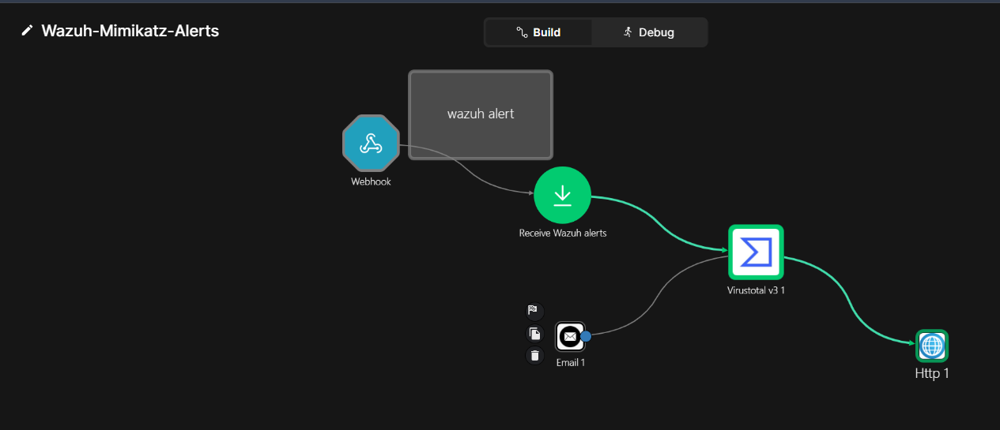

*The completed canvas: `Webhook` → `Receive Wazuh alerts` (regex) →
`Virustotal v3 1` → `Http 1` (Discord). The disconnected `Email 1`
node is a leftover from an abandoned attempt — see
[troubleshooting.md](troubleshooting.md#email-notification).*

---

## Step 1: Wazuh sends the alert

Wazuh posts its Mimikatz-detection alert to a Shuffle **Webhook**
trigger the moment the rule fires — no polling, no delay. The alert
here comes from a **real** detection on the enrolled Windows 10 agent
(`win-agent1`), not a synthetic test payload:

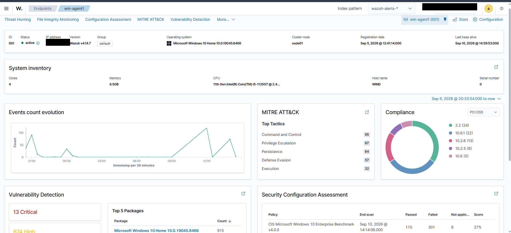

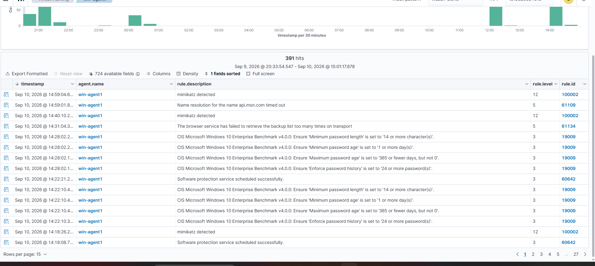

*Rule `100002` — "mimikatz detected" — firing repeatedly at severity
level 12 in the Wazuh dashboard.*

The raw alert JSON carries a single combined hash field, all three
hash types mashed together as one string:

```
MD5=E930B05EFE23891D19BC354A4209BE3E,SHA256=92804FAAAB2175DC501D73E814663058C78C0A042675A8937266357BCFB96C50,IMPHASH=1355327F6CA3430B3DDBE6E0ACDA71EA
```

That's not usable as-is — VirusTotal wants a clean hash, not a
labelled CSV fragment. Something has to pull the SHA256 back out.

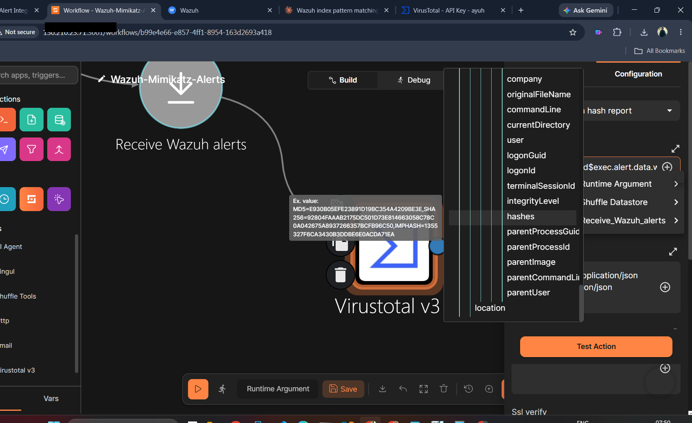

---

## Step 2: Pulling the hash out with Regex

A **Regex capture group** node sits between the trigger and
VirusTotal, doing exactly one job: extract the 64-character SHA256
value from that messy combined string.

- **Input data:** `$exec.alert.data.win.eventdata.hashes`
- **Regex pattern:** `SHA256=([0-9A-Fa-f]{64})`

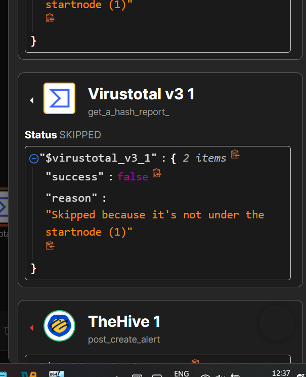

Run it, and the node returns three fields — `success`, `group_0` (the
captured value, as a **list**), and `found`:

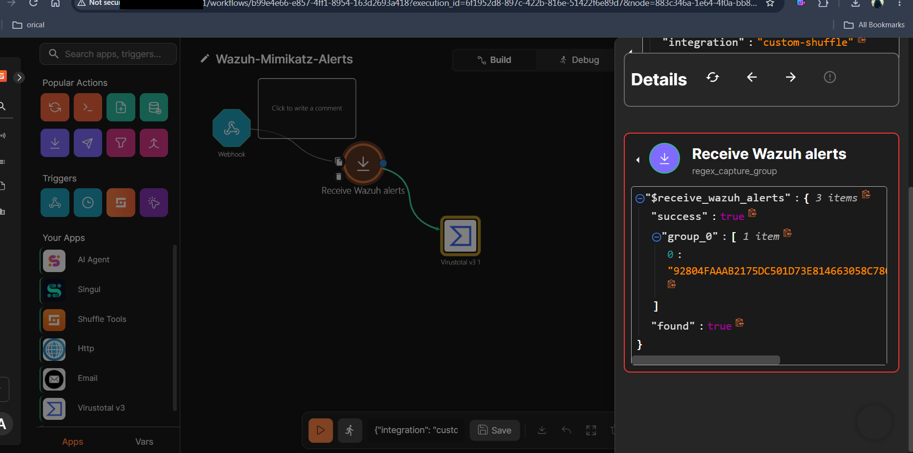
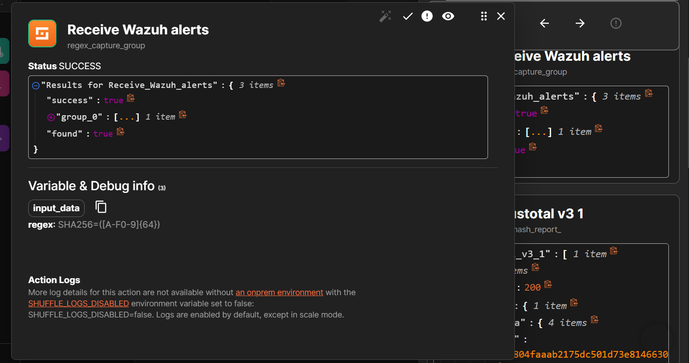

```json
{
  "success": true,
  "group_0": ["92804FAAAB2175DC501D73E814663058C78C0A042675A8937266357BCFB96C50"],
  "found": true
}
```

> 📝 **Naming gotcha.** This node kept Shuffle's auto-assigned default
> name, `Receive_Wazuh_alerts` — which, out of context, looks
> suspiciously like it *is* the trigger. It isn't; it's a normal,
> separate node one step downstream of the real `Webhook` trigger.
> This cost real debugging time for no good reason — see
> [troubleshooting.md](troubleshooting.md#node-naming-confusion) for
> the full mix-up, and the one-line fix (just rename nodes on creation)
> for avoiding it next time.

---

## Step 3: Asking VirusTotal about it

The **VirusTotal v3 — Get a hash report** action takes the extracted
hash as its `Id` parameter — this is the enrichment step, turning
"here's a hash" into "here's what the antivirus world thinks of this
hash."

- **Id:** `$receive_wazuh_alerts.group_0.#`

That trailing `.#` isn't a typo — it's Shuffle's own syntax for "this
is a list, use whichever index applies here," auto-inserted by the
variable picker. It looks broken when you eyeball it, but it resolves
correctly once the workflow actually runs — see
[troubleshooting.md](troubleshooting.md#virustotal-id-field--list-index-syntax)
for why that distinction matters and how it was confirmed.

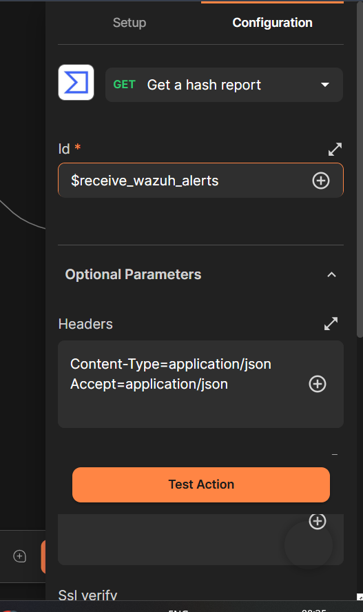

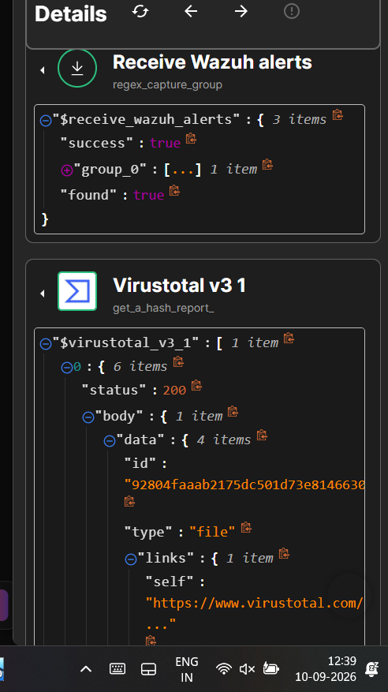
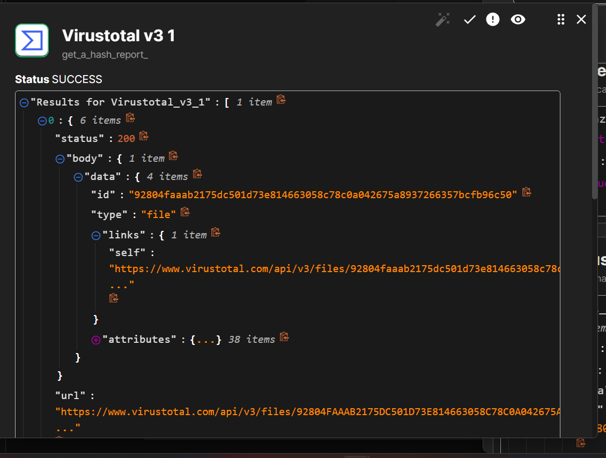

*Status `200`, with `data.id` matching the extracted hash and a full
`attributes` object (38 fields) confirming a real reputation lookup
happened — not a mocked response.*

---

## Step 4: Telling a human (Discord)

Originally this step was going to be TheHive (create a case) → email
(notify the analyst). Both got replaced with a single **Discord
webhook**, called via a generic **HTTP** node — the reasoning for each
swap is in [troubleshooting.md](troubleshooting.md).

### HTTP node configuration

- **Method:** `POST`
- **URL:** the Discord webhook URL
- **Headers:** `Content-Type=application/json`

> Note the `=`, not `:` — Shuffle's Headers field wants `Key=Value`
> syntax specifically. Using the more familiar HTTP-header colon
> syntax (`Content-Type: application/json`) gets silently misread and
> Discord rejects it with a 400. Full story:
> [troubleshooting.md](troubleshooting.md#discord-http-node--content-type-header-format).

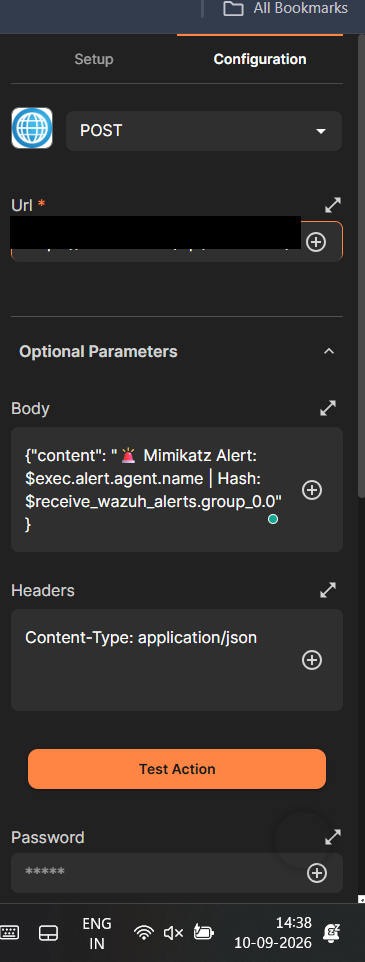

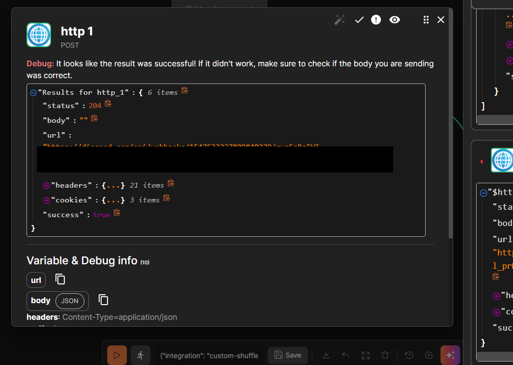
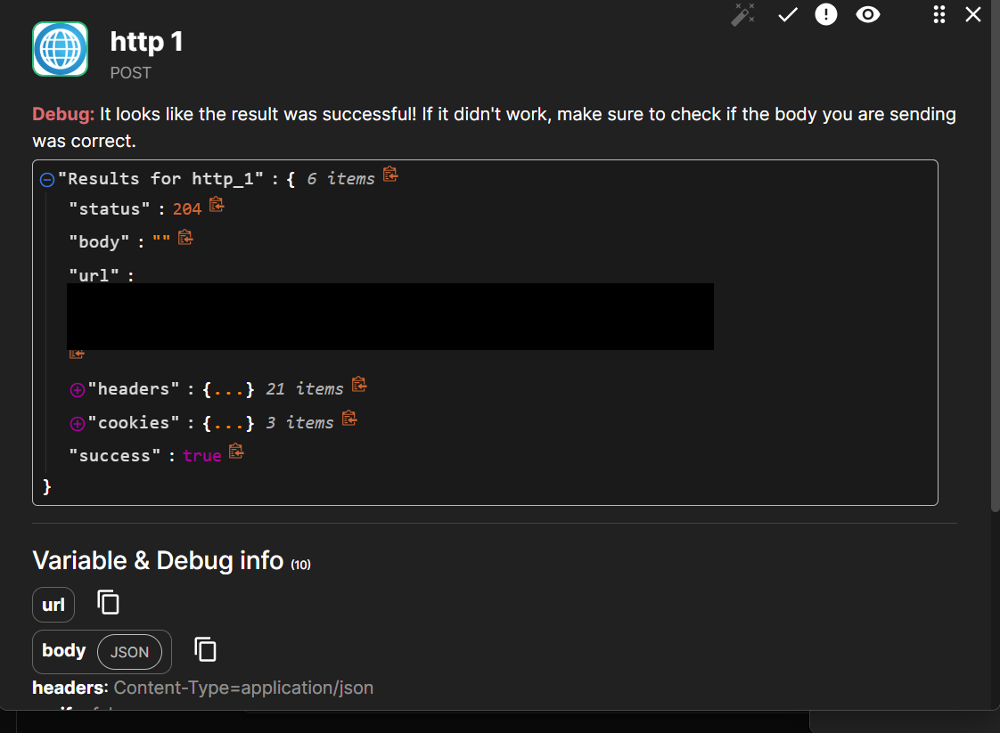

*Status `204` — Discord's standard "webhook accepted, no content to
return" success response.*

### First working version (plain text)

Get something — anything — working end-to-end before making it
pretty. This was the very first version that actually posted
successfully:

```json
{"content": "🚨 Mimikatz Alert: $exec.alert.agent.name | Hash: $receive_wazuh_alerts.group_0.0"}
```

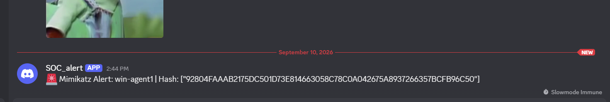

Notice `group_0.0` here, not `group_0.#` — once you need a *specific*
single value rather than "let Shuffle figure out the index," you
address the list by its numeric position directly.

### Upgraded version (structured Discord embed)

Once the plain-text version proved the pipe worked, it got upgraded
into a proper structured card — the version an analyst would actually
want to triage from at a glance:

```json
{
  "embeds": [
    {
      "title": "🚨 Mimikatz Detected",
      "color": 15158332,
      "fields": [
        { "name": "Agent", "value": "$exec.alert.agent.name", "inline": true },
        { "name": "Agent ID", "value": "$exec.alert.agent.id", "inline": true },
        { "name": "Rule", "value": "$exec.alert.rule.description", "inline": false },
        { "name": "Severity Level", "value": "$exec.alert.rule.level", "inline": true },
        { "name": "SHA256 Hash", "value": "$receive_wazuh_alerts.group_0.0", "inline": false }
      ],
      "footer": { "text": "Wazuh + Shuffle SOC Automation" }
    }
  ]
}
```

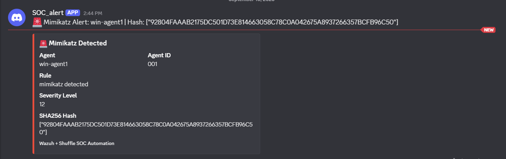

*The final result: agent name, agent ID, rule description, severity,
and a clean SHA256 hash — no stray brackets or quotes left over from
the list-type field.*

---

## Why "test one node" isn't the same as "run the workflow"

This is worth its own callout because it was, by a wide margin, the
most repeated source of confusion while building this. Shuffle's
per-node **Test Action** button only runs *that* node, in isolation —
it does **not** run the nodes upstream of it first. Any node not
"under the start node" for that isolated test gets marked `SKIPPED`,
which means `$exec.*` and `$receive_wazuh_alerts.*` variable
references have nothing real to resolve against. Shuffle doesn't
error out cleanly in that case — it passes the literal unresolved
text (`$exec.alert.agent.name`, verbatim) straight through, which then
breaks JSON parsing wherever it lands.

**The practical rule that came out of this:** if an error contains a
literal `$` in it — in the error message, the request body, or the
URL — check whether the workflow was run end-to-end via the canvas
▶️ **Play** button before assuming the variable path itself is wrong.
Nine times out of ten here, it wasn't the path; it was testing the
wrong thing in isolation. Full writeup:
[troubleshooting.md](troubleshooting.md#test-action-vs-full-run).

---

⬅️ Back to [setup.md](setup.md) · Next up: [troubleshooting.md](troubleshooting.md) →
